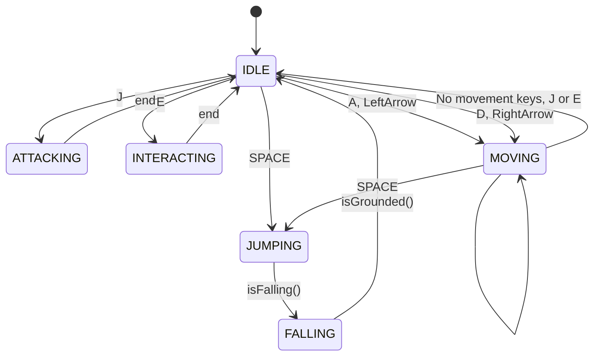
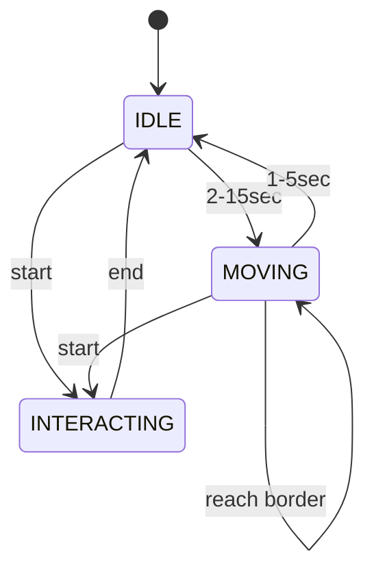

# Player State Machine

```mermaid
stateDiagram-v2
    [*] --> IDLE

    IDLE --> ATTACKING : J
    IDLE --> JUMPING : SPACE
    IDLE --> INTERACTING : E
    IDLE --> MOVING : A, LeftArrow
    IDLE --> MOVING : D, RightArrow

    MOVING --> IDLE : No movement keys, J or E
    MOVING --> JUMPING : SPACE
    MOVING --> MOVING

    JUMPING --> FALLING : isFalling()
    FALLING --> IDLE : isGrounded()

    ATTACKING --> IDLE : end
    INTERACTING --> IDLE : end
```

# Friendly NPC State Machine

```mermaid
stateDiagram-v2
    [*] --> IDLE

    IDLE --> INTERACTING : start
    IDLE --> MOVING : 2-15sec
    
    MOVING --> INTERACTING : start
    MOVING --> IDLE : 1-5sec
    MOVING --> MOVING : reach border
    
    INTERACTING --> IDLE : end
```
